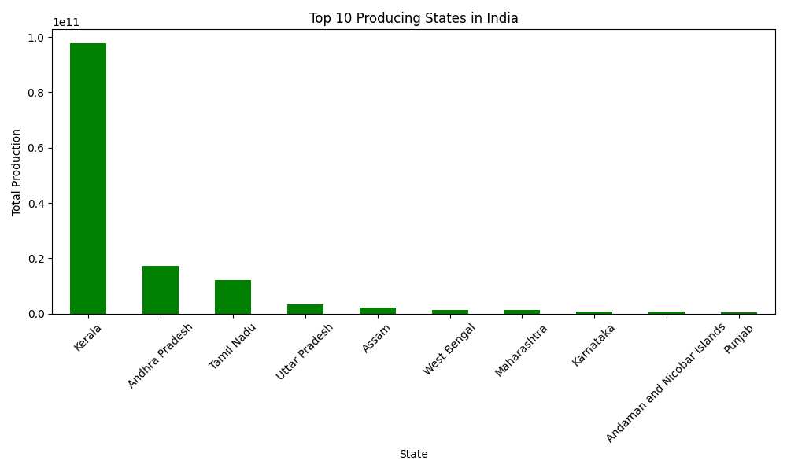
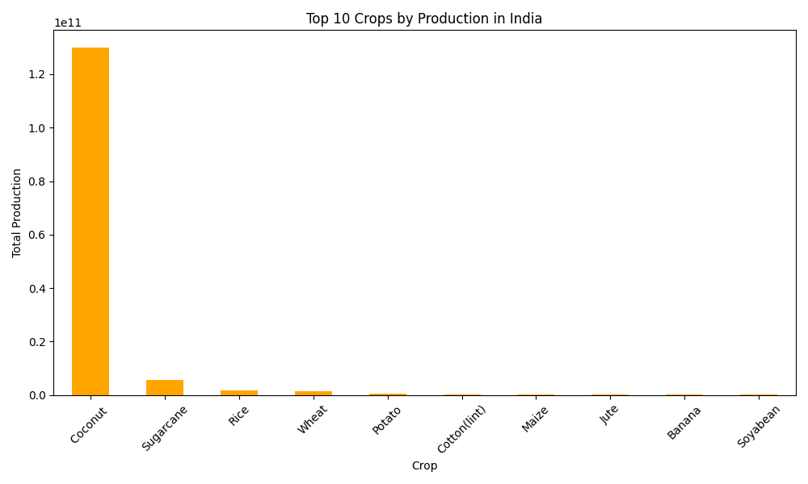

# Crop Yield Statistics Explorer — India

Analysing crop production trends across Indian states 
using real agricultural data from 1997 to 2015.

Built by **Padma Shree Jena** | Bengaluru, India

---

## What I Found

| Question | Answer |
|----------|--------|
| Highest producing state | Kerala |
| Top crop by production | Coconut |
| Total records analysed | 242,361 |
| States covered | 33 Indian states |

Kerala dominates because of massive coconut production.
Coconut alone accounts for more production than all other crops combined.

---

## Charts

### Top 10 Producing States

### Top 10 Crops by Production

---

## Tech Stack
Python, Pandas, Matplotlib

## Data Source
Kaggle — Crop Production in India

## License
MIT
